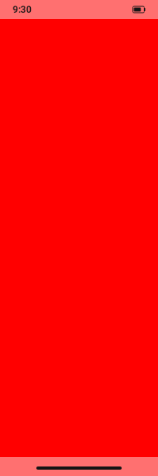

# Activity system UI evidence

Focused Robolectric capture of the same classic `Activity` before and after
`AppTourRenderer.addSystemBarsOverlay`. The solid red content makes the overlay boundary explicit:
the fixed capture adds the status bar (clock and battery) and bottom navigation bar without
resizing or replacing the activity content.

| Before | After |
| --- | --- |
|  |  |

Captured by `SystemBarsFrameTest.activity capture overlay supports a classic
non-ComponentActivity`; the committed test asserts the top and body pixels while the PNGs provide
reviewable visual evidence.
