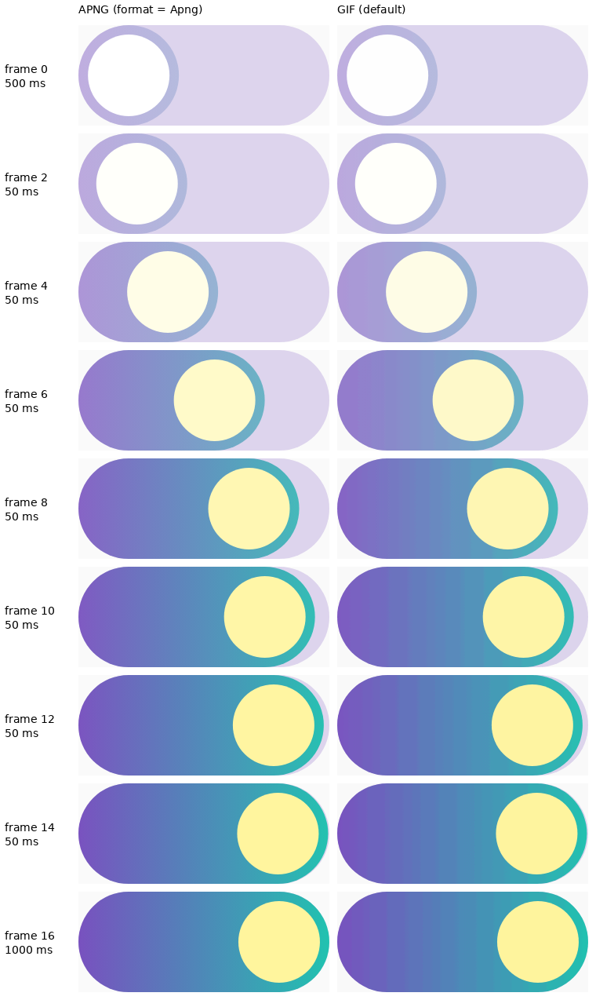

# Android `@AnimatedPreview(format = Apng)` evidence

Android `@AnimatedPreview` captures used to ignore `format` and always wrote GIF. The renderer's
`AnimationCapture` now reads the `format` key the plugin already writes, and an APNG request goes
through `:data-motion-core`'s `ApngEncoder`, the same encoder `@InteractionPreview` uses. That
gives full colour, 8-bit alpha, changed-region frames and an exact rational delay for every frame.
GIF is still the default, and its bytes are unchanged.

Every other frame of an 800 ms capture at 50 ms per frame, APNG on the left and GIF on the right:

How the evidence was produced:

- **Fixture.** A throwaway fixture: a gradient pill whose fill fades from 25 % to 85 % opacity
  while a thumb slides across it. Rendered through `handleAnimatedCapture` (Robolectric, SDK 34,
  xhdpi).
- **The capture.** The GIF and the APNG were captured from the same composition, in separate
  runs. Both have **17 frames**. The APNG declares `1/2 s, 16 × 50/1000 s, 1/1 s`, and Pillow
  reads the same timings back (500 ms, 16 × 50 ms, 1000 ms) as an independent decoder.
- **GIF unchanged.** The GIF from this branch has the same SHA-256 as the GIF `origin/main`
  renders from the same fixture: `2bfc78e6…13ff`.
- **What the strip shows.** The gradient bands in the GIF column are palette quantisation. The
  APNG column keeps the gradient.
- **The capture file.** [`toggle.apng`](toggle.apng) is the capture itself (112 KB, against the
  GIF's 104 KB). It is linked rather than embedded because `raw.githubusercontent.com` serves
  `.apng` as `application/octet-stream`.
