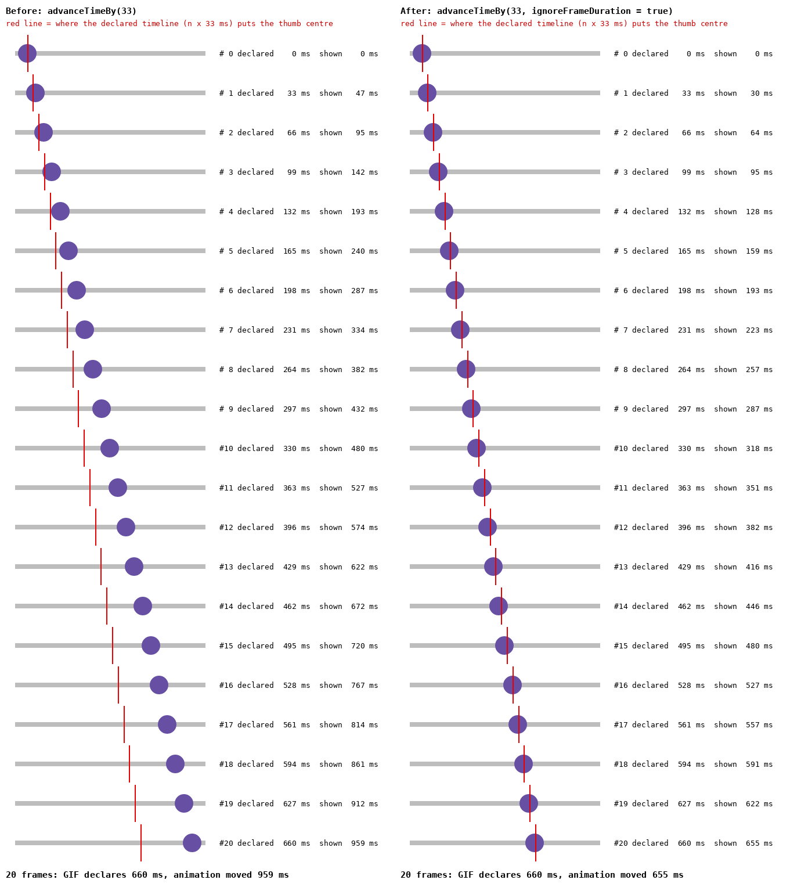

# Android animated-GIF frame timing evidence

Android `@AnimatedPreview` / `@InteractionPreview` captures stepped their paused Compose clock with
`MainTestClock.advanceTimeBy(frameIntervalMs)`. That call rounds up to whole 16 ms frames, so a
33 ms frame moved the animation 48 ms and a 50 ms frame moved it 64 ms. The GIF still declared
33 / 50 ms, so every Android animated and interaction GIF played ≈1.45× / ≈1.28× too fast. This is
the same bug the desktop renderer had
([desktop evidence](../desktop-gif-frame-timing/README.md)), and the fix is the same:
`advanceTimeBy(frameIntervalMs, ignoreFrameDuration = true)`, through `advanceMotionFrame` in
`RobolectricRenderTest.kt`.

The test clock still dispatches frames only on its 16 ms ticks. A 33 ms frame therefore shows
32 or 48 ms of motion (averaging 33). The change is that the error now stays inside that one tick
instead of compounding.

| Linear slider sweep (1000 ms per pass), 33 ms frames, 660 ms window |
| --- |
|  |

The frames were rendered through `handleAnimatedCapture` (Robolectric, SDK 34, xhdpi,
`showCurves = false`) from a throwaway fixture. Each run used the same commit's renderer, once
with `advanceMotionFrame` and once with the rounding overload restored. The "shown" times are
measured from the GIF's pixels (296 px of thumb travel per 1000 ms). Each red line marks where the
declared timeline puts the thumb. The committed gate is `AndroidAnimatedFrameTimingTest`, which
reads the animation clock off a 1 px-per-ms ruler through both the animated and the interaction
capture paths.
