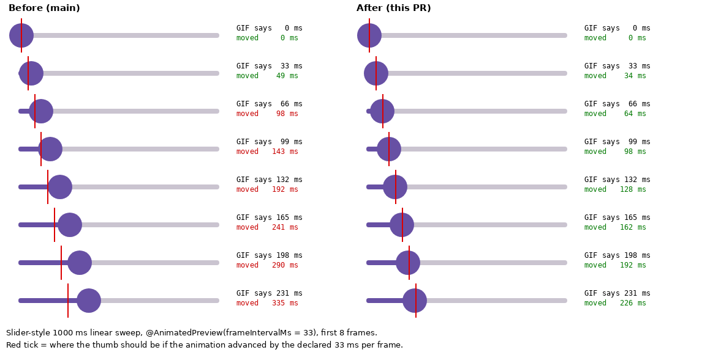
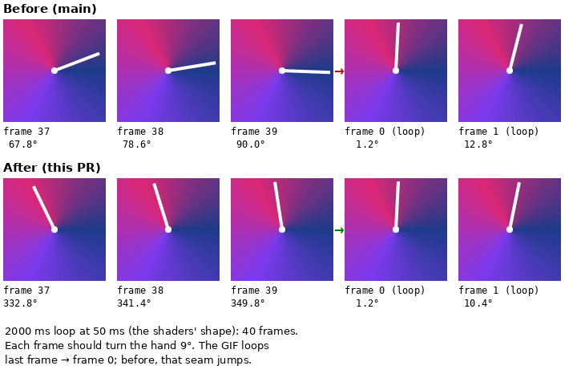

# Desktop animated-GIF frame timing evidence

Desktop `@AnimatedPreview` / `@InteractionPreview` captures stepped their paused clock with
`MainTestClock.advanceTimeBy(frameIntervalMs)`, which rounds up to whole 16 ms frames. A 33 ms
frame moved the animation 48 ms and a 50 ms frame moved it 64 ms, while the GIF still declared
33 / 50 ms — so every desktop animated GIF played ≈1.45× / ≈1.28× too fast and a loop-length
capture no longer closed on itself. The fix advances with `ignoreFrameDuration = true`
(`advanceMotionFrame` in `DesktopMotionCapture.kt`).

The harness still only samples animations on its 16 ms render loop, so a 33 ms frame shows 32 or
48 ms of motion (averaging 33); what changes is that the error stays inside that one tick instead
of compounding.

| Slider-style sweep, 33 ms frames |
| --- |
|  |

| 2000 ms loop at 50 ms (the shaders' shape): the loop seam |
| --- |
|  |

Rendered through `renderAnimatedPreview` at density 2 from two throwaway fixtures (a 164 dp
linear slider sweep over 1000 ms, captured at the 1500 ms auto-detect fallback window; and a clock
hand turning once per 2000 ms, captured for 2000 ms), with the same commit's renderer and with
`advanceMotionFrame` reverted to the rounding overload. The positions and angles printed beside
each frame are measured from the GIF's pixels. The committed gate is
`DesktopAnimatedFrameTimingTest`, which reads the animation clock off a 1 px-per-ms ruler.
