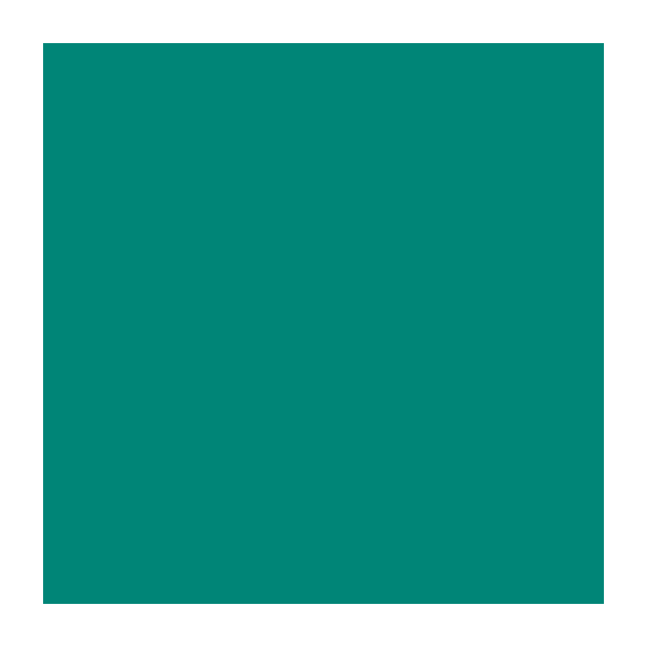

# Record against the final preview viewport

The real Compose UI-builder native HTTP/MCP route compiled the adjacent generated Remote Compose
source against AndroidX alpha18 and the Android daemon 3.2.0 classpath. `@Preview` fixes both axes at
360 dp; the output is 720 × 720 at the daemon's default 2× density.

Before the fix the green state occupied x=48…671, y=48…559: a 56 dp height loss. The host action bar
was hidden by Roborazzi at capture time, after the first composition had recorded its smaller frame.
Hiding the host bar in `PreviewHostTheme.applyTo`, before composition on both live and batch paths,
produces x=48…671, y=48…671. All four edges now have the authored 24 dp padding. No image is resized
or repaired after rendering.

| Before | After |
| --- | --- |
|  |  |

The consumer's real HTTP and hosted MCP calls produce byte-identical PNGs. Its opt-in
`RemoteNativeRenderProofTest` asserts the frame, padding boundaries and selected green state.
The renderer's `PreviewHostThemeTest` also creates an action-bar host explicitly and verifies the
bar is hidden during host setup even when no theme override is configured.

This uses the local release AAR's `classes.jar` in the matching daemon sidecar, so verification
requires no Maven release. The temporary consumer classpath is local evidence, not a change to
published dependency versions.
